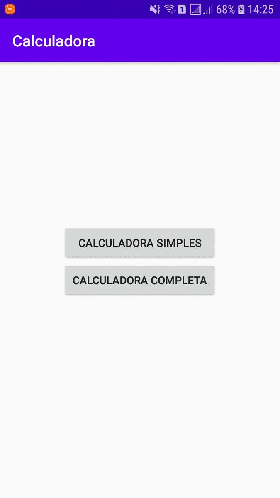

# :1234: Calculadora v1.0
Essa aplicação permite ao usuário escolher entre dois tipos de calculadora, simples e completa.

A calculadora simples espera que o usuário digite dois valores numéricos e escolha
uma das quatro operações matemáticas básicas representadas por botões.

A calculadora completa possui comportamento muito similar às calculadoras tradicionais.

## :computer: Tecnologias

Este projeto foi desenvolvido com as seguintes tecnologias:

-  [Java](https://www.java.com/pt-BR/)
-  [Android](https://developer.android.com/docs)
-  [Android Studio](https://developer.android.com/studio)

### :arrow_forward: Em Execução:

<p align="center">
 
</p>

### :information_source: Como usar:

Para clonar e executar este aplicativo, você precisará do Git e Android Studio instalados em seu computador. Na linha de comando:

```bash
# Clonar este repositório
$ git clone https://github.com/DiegoTeixeira7/Calculadora.git

# Abra o projeto em seu Android Studio e execute

```
### :memo: Licença
Este projeto está sob a licença do MIT. Consulte a [LICENSE](https://github.com/DiegoTeixeira7/Calculadora/blob/master/LICENSE) para obter mais informações.
